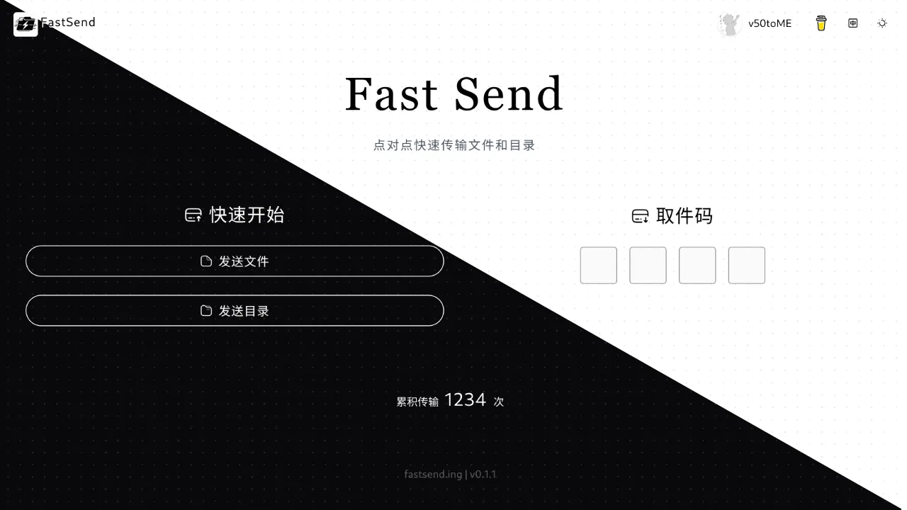

<h1 align="center">FastSend 文件快传 🚀</h1>

<p align="center">
  
  <a href="#" target="_blank">
    
  </a>
</p>

<p align="center">
  
</p>

## 📖 项目介绍

FastSend 是一个基于 WebRTC 技术的点对点文件传输工具，支持快速的目录同步和文件传输。通过浏览器即可实现安全、高效的文件共享。

🌐 在线体验：[fastsend.ing](https://fastsend.ing)

## ✨ 特性

- 🔒 点对点加密传输，确保数据安全
- 📁 支持文件和文件夹传输
- 🚀 局域网自动优化，传输更快
- 🎯 简单易用的界面设计
- 🌍 支持中英文界面
- 📲 支持PWA轻量安装

## 🛠️ 技术栈

- WebRTC
- Vue.js
- Nuxt3
- TypeScript
- Modern File System API

## 📦 安装与构建

```bash
# 安装依赖
yarn install

# 构建项目
yarn build
```

## 🚀 使用方法

```bash
# 启动服务
node .output/server/index.mjs
```

## 💡 使用提示

1. 确保浏览器启用了 WebRTC 功能
2. 如需传输文件夹，请确保浏览器支持现代文件系统 API
3. 在同一局域网内传输速度最快
4. 建议在网络状态良好时使用

## 👨‍💻 作者

**ShouChen**

- 博客: [shouchen.blog](https://shouchen.blog)
- X: [@ShouChen\_](https://x.com/ShouChen_)

## 🤝 贡献

欢迎提交 Issue 和 Pull Request！

## 📝 开源协议

本项目基于 MIT 协议开源。

## ⭐ 支持项目

如果这个项目对你有帮助，欢迎给一个 star 支持一下！

---

<a href="https://star-history.com/#ShouChenICU/Fastsend&Date">
 <picture>
   <source media="(prefers-color-scheme: dark)" srcset="https://api.star-history.com/svg?repos=ShouChenICU/Fastsend&type=Date&theme=dark" />
   <source media="(prefers-color-scheme: light)" srcset="https://api.star-history.com/svg?repos=ShouChenICU/Fastsend&type=Date" />
   
 </picture>
</a>
